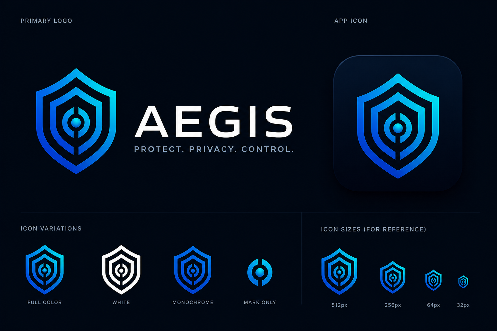

# 🛡️ Aegis

  

  <strong>Privacy-first personal life system</strong> 
  Protect. Organize. Assist. — under your control.

  
  
  
  

---

## 🧠 What is Aegis?

Aegis is a local-first, privacy-focused platform designed to manage every aspect of your digital life — securely, intelligently, and transparently.

It combines:

- 🔐 Data protection  
- 🤖 AI assistance  
- 🧩 Modular services  
- 🔄 Workflow automation  
- 👤 User-controlled privacy  

All in one system.

---

## 🔐 Core Philosophy

> You cannot trust a system unless it cannot betray you.

Aegis is built so that:

- Your data belongs to you  
- Sensitive data is protected with zero-knowledge encryption  
- No one (not admins, not developers) can access your private data  
- Nothing is shared unless you explicitly choose it

---

## 🛡️ Privacy & Protection

- 🔐 Zero-knowledge encryption (user-only access)  
- 🛡️ Auto-Protect Mode (your data bodyguard)  
- ⚠️ Risk-aware third-party integrations  
- 🧠 Informed consent before data sharing  
- 🔍 Continuous security auditing  
- 📜 Public security reports  

---

## 🤖 AI That Works For You

Aegis includes an AI assistant that:

- helps organize and interpret your data  
- assists with daily tasks  
- provides insights and recommendations  

But:

- it only uses data you allow  
- it never shares data externally without your approval  
- it respects all privacy boundaries  

---

## 🌐 Third-Party Integrations

Aegis supports integrations (email, storage, etc.), but:

> External services operate outside Aegis.

Before any data is shared:

- You see what data is involved  
- You see the risks  
- You must explicitly approve  

No silent data sharing. Ever.

---

## 🧩 Architecture

- ⚙️ Raw PHP (no heavy frameworks)  
- 🧠 Front controller + modular system  
- 🔐 RBAC (role-based access control)  
- 🗄️ SQLite (default) or MySQL  
- 🔒 Encrypted vault system  
- 🔌 API-driven modules  

---

## 🚀 Installation

bash git clone https://github.com/phreakin/aegis.git cd aegis 

Run installer:

bash php install.php 

Or browser:

text http://localhost/install 

---

## ⚠️ Important

If you enable zero-knowledge encryption:

> If you lose your password or recovery key, your data cannot be recovered.

This is intentional.

---

## 📁 Project Structure
~~~
/public → web root
/core → system engine
/config → configuration
/data → database & vault
/docs → documentation
~~~

---

## 📚 Documentation

- 📜 Privacy Policy → docs/privacy/plain-english.md  
- 🔐 Security → docs/security/  
- 🤖 AI Behavior → docs/ai/  
- 🛠️ Developer Docs → docs/development/  

---

## 🔐 Security & Transparency

Aegis includes a public audit system:

- Continuous code scanning  
- AI-assisted vulnerability detection  
- Public security logs  
- Responsible disclosure process  

See:
~~~
/security-reports/ 
~~~
---

## 🤝 Contributing

Contributions are welcome — with one rule:

> Protect the user first.

When contributing:

- respect privacy principles  
- avoid introducing data exposure risks  
- explain your changes clearly  

---

## 🧪 Reporting Vulnerabilities

If you find a security issue:

- do not exploit it  
- report it responsibly  
- or submit a secure patch  

---

## 📜 License

Licensed under GNU AGPLv3

This ensures:

- the project remains open  
- improvements stay public  
- no closed-source exploitation  

---

## 🧠 Why “Aegis”?

The name comes from ancient mythology.

The Aegis was a shield carried by Zeus and Athena — representing:

- protection  
- wisdom  
- strength  

That’s exactly what this system is built to provide.

---

## 🌱 Vision

Aegis exists because no system today combines:

- privacy  
- clarity  
- assistance  
- control  

into one place.

This project aims to change that.

If it helps even one person — it succeeds.

---

## 💬 Final Thought

You shouldn’t have to trust a system blindly.

With Aegis — you don’t have to.

---

  <strong>Aegis — built to protect what matters most.</stron
